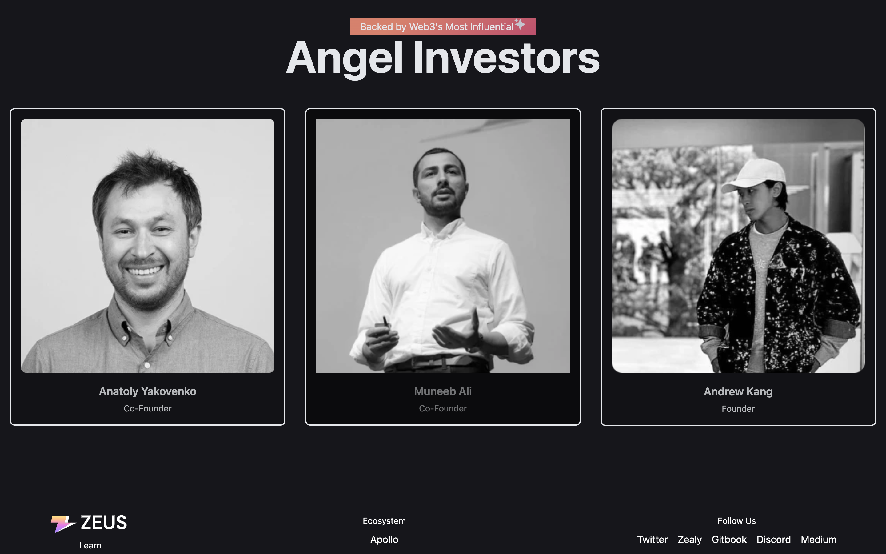

# ZEUS Network

This website is inspired by the design of the $ZEUS token website. The $ZEUS website utilizes a clean, modern, bold, colorful aesthetic to effectively communicate its brand and message. I aim to capture similar elements to create a user-friendly and visually appealing website for similar purposes.

Features

A prominent visually appealing landing page for #crypto related services/websites.
- FlexBox Layout

# Tech Stack & Misc libs:
(will keep updating until the finish line)
- Tailwind 
- React
- JavaScript
- For Gradient Colors CSS https://www.eggradients.com/
- Animations https://www.npmjs.com/package/framer-motion 
- react-scatter-graphy
- react-intersection-observer

# How it Looks
GIF

Photos
 
 

